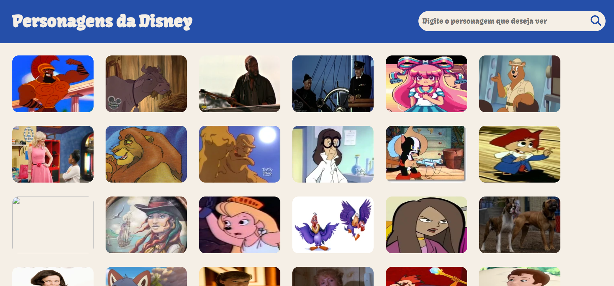
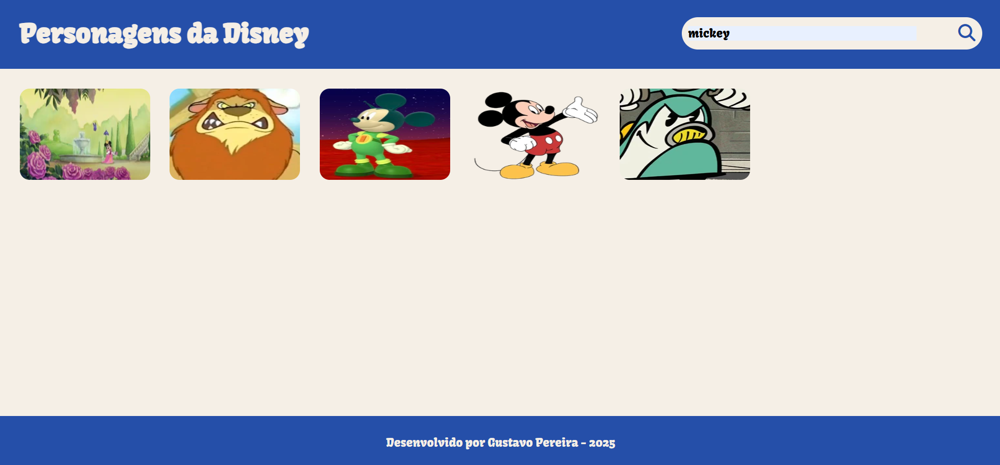
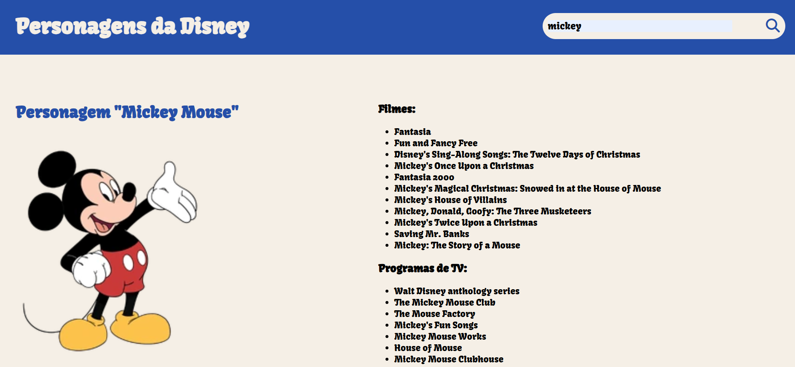

# Site de personagens da Disney

Este é um site interativo que permite aos usuários explorar o vasto universo de personagens da Disney. Utilizando a [API pública da Disney](https://disneyapi.dev/), a aplicação exibe uma galeria de personagens, permite a busca por nomes específicos e apresenta detalhes sobre cada um.

## Funcionalidades

-   **Tela inicial:** A página inicial carrega uma galeria com todos os personagens disponíveis na API.
-   **Tela de pesquisa:** Pesquise por qualquer personagem da Disney pelo nome.
-   **Tela de detalhes do personagem:** Clique em um personagem para ver informações detalhadas, como:
    -   Filmes
    -   Curtas-metragens
    -   Programas de TV
    -   Jogos
    -   Aliados e inimigos
-   **Design Responsivo:** O site se adapta perfeitamente a diferentes tamanhos de tela, como desktops, tablets e celulares.

## Design e Layout

O planejamento visual e a prototipagem do projeto foram realizados utilizando as seguintes ferramentas e conceitos:

### Wireframe
A estrutura básica e o esqueleto de cada página foram definidos nos wireframes, focando na usabilidade e na disposição dos elementos.

-   **[Ver Wireframe da Página Inicial](https://wireframe.cc/BzNHEz)**
-   **[Ver Wireframe da Página de Pesquisa](https://wireframe.cc/r28Kmb)**
-   **[Ver Wireframe da Página de Detalhes](https://wireframe.cc/MEFXeg)**

### Design no Figma
O design de alta fidelidade, incluindo cores, fontes, espaçamentos e a aparência final da interface, foi criado no Figma.

-   **[Ver Design completo no Figma](https://www.figma.com/design/HI3QOUQTyiICA8yjFtkfyX/Projeto-API-Publica?node-id=0-1&t=QRQCTb53v0UgK3X7-1)**

## Fotos do site

Aqui abaixo estão algumas imagens do site:

### Tela Inicial (Galeria de Personagens)
*Nesta tela, todos os personagens são exibidos*

### Tela de Pesquisa
*Resultado da busca por um personagem específico*

### Tela de Detalhes do Personagem
*Aqui são mostradas todas as informações detalhadas de um personagem selecionado*

## Tecnologias utilizadas para criar o site
* HTML
* CSS
* JS
* Disney API

## API Utilizada

Este projeto consome os dados da **Disney API**, uma API RESTful gratuita com dados sobre personagens da Disney. Link da documentação em: [https://disneyapi.dev/](https://disneyapi.dev/)

## Autor
[Gustavo Pereira](https://www.linkedin.com/in/gustavo-pereira-dev-redes)